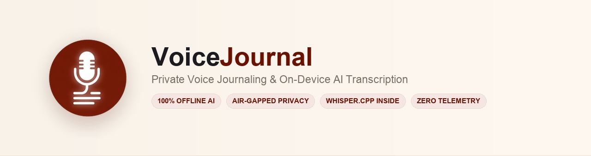
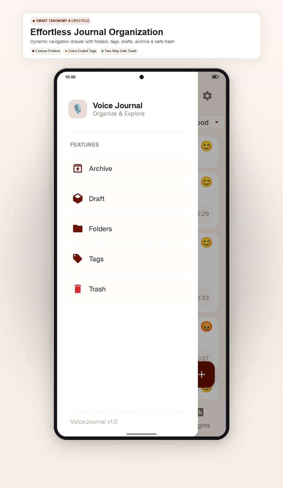

# VoiceJournal

<p align="center">
  
</p>

<p align="center">
  <strong>
    A privacy-first Android voice journaling app with fully offline AI transcription powered by Whisper.cpp.
  </strong>
</p>

<p align="center">
  <a href="https://github.com/rajroshan110/VoiceJournal/releases/tag/v1.0.4"></a>
  <a href="https://developer.android.com/about/versions/10"></a>
  <a href="https://developer.android.com/about/versions/15"></a>
  <a href="https://github.com/ggerganov/whisper.cpp"></a>
  <a href="https://kotlinlang.org"></a>
  <a href="https://developer.android.com/jetpack/compose"></a>
  
  <a href="LICENSE"></a>
</p>

---

## Overview

**VoiceJournal** is a modern, privacy-first Android application that lets you record voice reflections and automatically transcribe them **entirely on your device** using Whisper.cpp.

- **100% Local Inference**: Runs offline directly on your smartphone with no cloud servers or external API calls.
- **Bilingual Speech-to-Text**: Optimized for **English** and **Hindi/Urdu** speech out-of-the-box.
- **Strict Privacy**: Zero tracking, zero telemetry, no accounts, no subscriptions, and zero advertisements.
- **Zero Storage Permissions**: Built for Android 10+ (API 29–35) utilizing the modern Android Photo Picker (`PickVisualMedia`) and isolated sandbox storage.

Your recordings, notes, and transcripts remain strictly on your device unless you explicitly export them.

---

## Features

- 🎤 **High-Fidelity Audio Recording**: Support for hardware-encoded **M4A (AAC-LC)** and studio-grade **16-bit PCM WAV (16kHz mono)**.
- 🎵 **Multi-Track Audio Journaling**: Attach multiple voice recordings to a single journal entry with real-time waveform visualizers.
- 🤖 **Offline AI Transcription**: On-device speech recognition via `whisper.cpp` (Base Q5 model, ~59.7 MB) with native ARM NEON acceleration.
- 🔒 **Privacy & Air-Gapped Security**: Zero analytics, zero cloud dependencies, and Keystore-backed PIN lock with biometric authentication.
- 📱 **Material Design 3**: Dynamic theming with adaptive **Light Premium Paper** and **Dark Obsidian** palettes.
- 🏷️ **Smart Organization**: Flexible categorization with custom nested folders, searchable tags, drafts, archive, and safe trash.
- 📂 **Secure Backup Import & Export**: Lossless `.zip` archive export with two-stage atomic restore protected against Zip-Slip and Zip-Bomb exploits.
- 🔍 **Sub-Second Local Search**: Fast full-text indexing across note titles, text bodies, and transcribed voice audio.
- ▶️ **Background Audio Playback**: Persistent media notification controls with lock-screen integration and standard audio focus management.
- 🛡️ **Model Deletion Guard**: Confirmation safety dialog preventing accidental removal of the offline transcription model.

---

## Screenshots

<div align="center">

<table>
<tr>
<td align="center" width="50%">
  <a href="assets/screenshots/home.jpg">
    
  </a>
  <br/>
  <b>Dashboard & One-Tap Capture</b>
  <p><i>Timeline feed with mood categorization, topic filters, and instant recording.</i></p>
</td>
<td align="center" width="50%">
  <a href="assets/screenshots/notes.jpg">
    
  </a>
  <br/>
  <b>Distraction-Free Note Editor</b>
  <p><i>Rich text writing, dynamic timestamps, multi-track audio notes, and mood tags.</i></p>
</td>
</tr>

<tr>
<td align="center" width="50%">
  <a href="assets/screenshots/transcript.jpg">
    
  </a>
  <br/>
  <b>Whisper.cpp AI Transcription</b>
  <p><i>High-precision offline bilingual speech-to-text with synced audio playback.</i></p>
</td>
<td align="center" width="50%">
  <a href="assets/screenshots/organize.jpg">
    
  </a>
  <br/>
  <b>Smart Organization & Taxonomy</b>
  <p><i>Custom nested folders, searchable tag filters, drafts, archive, and safe trash.</i></p>
</td>
</tr>

<tr>
<td align="center" width="50%">
  <a href="assets/screenshots/settings.jpg">
    
  </a>
  <br/>
  <b>Security & Preferences</b>
  <p><i>Android Keystore PIN lock, biometrics, Material 3 theming, and model management.</i></p>
</td>
<td align="center" width="50%">
  <a href="assets/screenshots/import-export.jpg">
    
  </a>
  <br/>
  <b>Local Data Sovereignty</b>
  <p><i>Lossless ZIP archive export and atomic staged restore with auto-rollback.</i></p>
</td>
</tr>
</table>

</div>

---

## Tech Stack

| Layer | Technology | Role |
|---|---|---|
| **Language** | Kotlin 2.0+ | Coroutines, Flow & StateFlow |
| **UI Framework** | Jetpack Compose | Declarative UI with Material Design 3 |
| **Dependency Injection** | Dagger Hilt | Modular compile-time DI |
| **Local Database** | Room SQLite | Transactional persistence & migrations |
| **Preferences** | Jetpack DataStore | Encrypted PIN, theme mode & audio settings |
| **Speech Recognition** | Whisper.cpp | Native C++ inference via JNI with ARM NEON |
| **Audio Engine** | Media3 ExoPlayer & AudioRecord | Foreground playback service & PCM capture |
| **Charts & Insights** | Vico Compose | Mood trends & recording activity metrics |
| **Image Loading** | Coil Compose | Asynchronous image loading & memory caching |

---

## Architecture

VoiceJournal is built following **Clean Architecture** with **MVVM** and **Unidirectional Data Flow (UDF)**:

```text
Presentation (Jetpack Compose)
        │
        ▼
ViewModels (StateFlow)
        │
        ▼
Domain (Use Cases & Repository Interfaces)
        │
        ▼
Data Layer (Room DB • DataStore • MediaStorageManager • Backup Orchestrators)
        │
        ▼
Infrastructure (Whisper.cpp JNI • AudioRecord • MediaCodec)
```

For complete package architecture documentation, see **[docs/ARCHITECTURE.md](docs/ARCHITECTURE.md)**.

### Project Layout

```text
app/src/main/
├── cpp/                     # Native C++ Whisper.cpp inference engine & JNI bindings
└── java/dev/voicejournal/
    ├── audio/               # Recording, MediaCodec M4A, WAV repair & playback service
    ├── data/                # Room DB, DataStore, repository implementations & backup orchestrators
    ├── di/                  # Hilt dependency injection modules
    ├── domain/              # Models, repository interfaces, and Use Cases
    ├── transcription/       # Local Whisper engine bindings & audio resamplers
    ├── ui/                  # 100% Jetpack Compose UI (journal, notedetail, organize, settings)
    └── util/                # FileUtils, DateUtils, and platform helpers
```

---

## Requirements

### Target Device
- **Operating System**: Android 10+ (`API 29+`) to Android 15 (`API 35`)
- **Permissions**: Zero storage permissions required (uses Android Photo Picker via `PickVisualMedia` and local sandbox storage)
- **Architecture**: 64-bit ARM (`arm64-v8a`) recommended for real-time inference speed
- **Memory**: 3GB+ RAM recommended (~200–300MB allocated during Whisper model execution)
- **Storage**: ~150MB free space (app binary + ~59.7MB Whisper model file)

### Build Environment
- **JDK**: Java 17 (e.g. Eclipse Adoptium Temurin 17)
- **Android Studio**: Ladybug / Meerkat (2024.2+) or newer
- **Android NDK**: 27.0.12077973+
- **CMake**: 3.22.1+

---

## Building from Source

1. **Clone the repository**:
   ```bash
   git clone https://github.com/rajroshan110/VoiceJournal.git
   cd VoiceJournal
   ```

2. **Run unit tests**:
   ```bash
   ./gradlew testDebugUnitTest
   ```

3. **Build debug APK**:
   ```bash
   ./gradlew assembleDebug
   ```
   The compiled APK will be at `app/build/outputs/apk/debug/app-debug.apk`.

4. **Install on device**:
   ```bash
   adb install -r app/build/outputs/apk/debug/app-debug.apk
   ```

---

## Privacy & Offline Architecture

VoiceJournal adheres to a strict offline-first philosophy:

- **No user accounts or logins**: Everything belongs to you.
- **No cloud sync or remote servers**: Audio and notes never leave your phone.
- **Zero telemetry or trackers**: No analytics, crash reporters, or advertising SDKs.
- **Local sandbox confinement**: All data is stored in the private application sandbox (`context.filesDir`).

### One-Time Whisper Model Download
To keep the repository lightweight and allow flexible updates:
1. On initial transcription (or via **Settings > General Settings > Speech Model**), the app downloads the quantized Whisper Base Q5 bilingual model (~59.7 MB) via HTTPS.
2. The downloaded model is cryptographically verified against a strict **SHA-256 checksum**:
   ```text
   422f1ae452ade6f30a004d7e5c6a43195e4433bc370bf23fac9cc591f01a8898
   ```
3. Once verified, the model is stored locally on device. **The app never connects to the internet again** for daily note-taking, search, or transcription.

---

## Roadmap

- [x] High-fidelity voice recording (M4A / AAC & 16-bit PCM WAV)
- [x] Offline bilingual AI speech transcription (English & Hindi/Urdu)
- [x] Interactive waveform audio player with lock-screen notification controls
- [x] Dynamic Material 3 design system with adaptive Dark & Light themes
- [x] Hardware-backed Keystore PIN lock and biometric app protection
- [x] Zip-Slip and Zip-Bomb protected full-fidelity Backup Import & Export
- [x] Dynamic folders, tag taxonomy, drafts, and multi-state trash/archive
- [x] Vico-backed habit consistency and mood distribution analytics
- [ ] Multi-language transcription model options (Spanish, French, German, Japanese)
- [ ] Selective individual note export to Markdown (`.md`) and audio package
- [ ] Hardware-encrypted backup archives with password protection (AES-GCM-256)
- [ ] Smart audio silence truncation and background noise suppression filter

---

## Contributing

Contributions are welcome! By submitting a pull request or contributing to VoiceJournal, you agree to the terms in the [Contributor License Agreement (CLA.md)](CLA.md).

1. Fork the repository
2. Create a feature branch: `git switch -c feature/your-feature-name`
3. Commit your changes: `git commit -m "feat(audio): add feature"`
4. Run tests: `./gradlew testDebugUnitTest`
5. Push and open a Pull Request

---

## License

VoiceJournal is licensed under the **GNU General Public License v3.0 with the Commons Clause Condition v1.0** — see the [LICENSE](LICENSE) file for complete details.

- **Source-Available**: You are free to inspect, fork, modify, and build the code for personal, non-commercial purposes.
- **Commercial Restriction**: The Commons Clause explicitly restricts selling the software or offering it as a paid commercial product or service.
- **Contributor Agreement**: All contributions are licensed to the project maintainer under our [Contributor License Agreement](CLA.md) to preserve project stewardship.

---

## Acknowledgements

- [whisper.cpp](https://github.com/ggerganov/whisper.cpp) by Georgi Gerganov — High-performance C++ implementation of OpenAI's Whisper model.
- [OpenAI Whisper](https://github.com/openai/whisper) — Robust speech recognition neural network architecture.
- [Android Open Source Project](https://source.android.com/) — Jetpack Compose, Room, and Material 3 design system.
- [Vico](https://github.com/patrykandpatrick/vico) — Extensible charting library for Jetpack Compose.
- [Coil](https://github.com/coil-kt/coil) — Kotlin-first image loading framework for Android.

---

## Author

**Raj Roshan**  
GitHub: [@rajroshan110](https://github.com/rajroshan110)

---

<p align="center">
  Built with ❤️ for people who value privacy.
</p>
