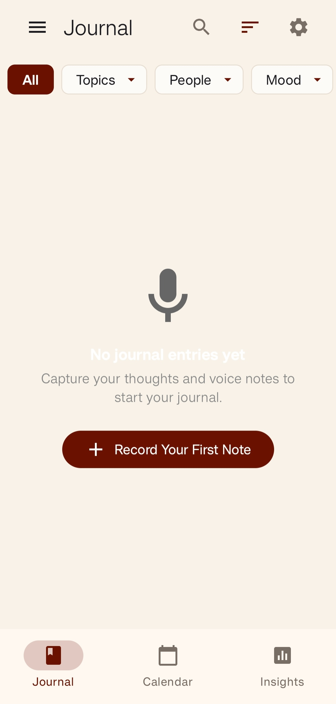
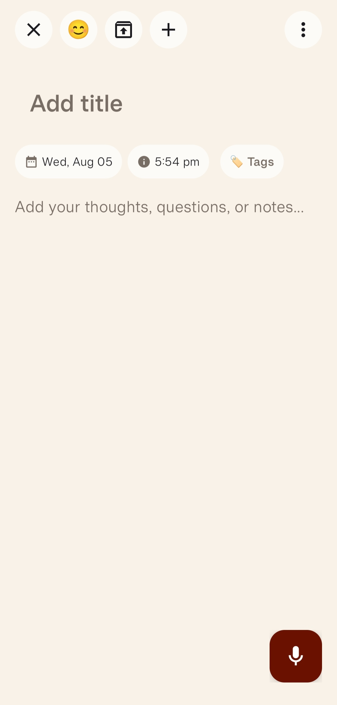
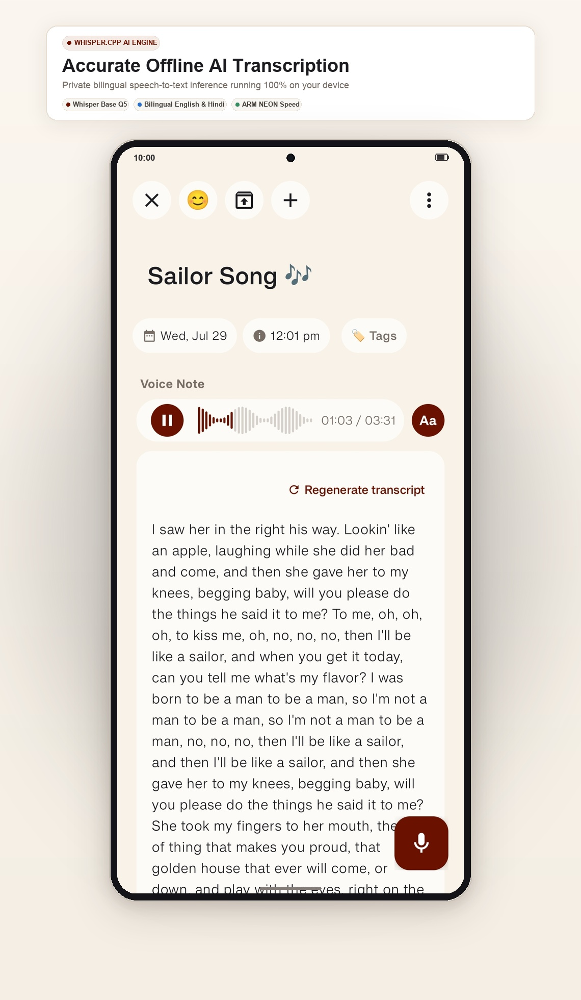
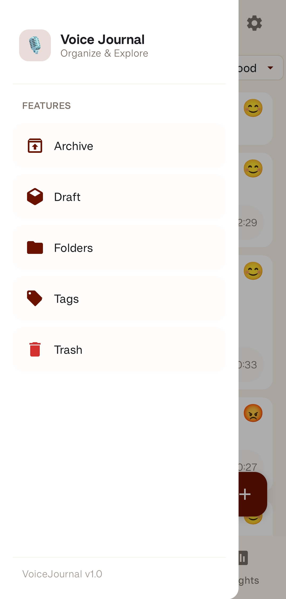
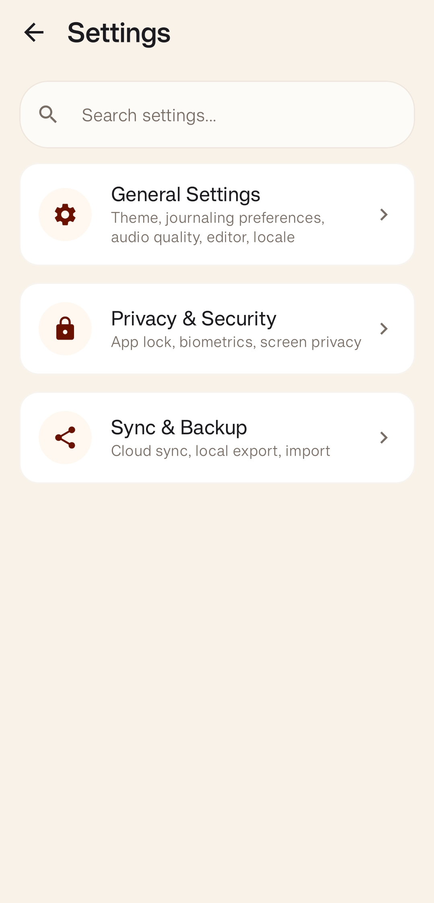
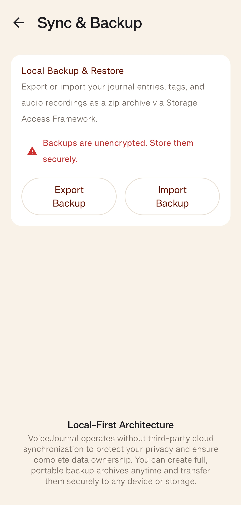

# VoiceJournal

<p align="center">
  
</p>

<p align="center">
  <strong>A private, offline-first voice journaling app powered by on-device AI.</strong>
</p>

<p align="center">


</p>

---

## Overview

VoiceJournal is a modern Android application that lets you record voice notes and automatically transcribe them **entirely on your device** using Whisper.cpp.

No cloud processing.

No accounts.

No subscriptions.

Your recordings and transcripts remain on your device unless you explicitly export them.

---

# Features

- 🎤 Record voice notes
- 🤖 Offline AI transcription (Whisper.cpp)
- 🔒 Privacy-first architecture
- 📱 Material Design 3 interface
- 🌙 Dark mode support
- ♿ Accessibility support
- 📂 Import & Export journals
- 🔍 Search transcripts
- 📝 Edit journal entries
- ▶️ Built-in audio playback
- 💾 Local storage
- ⚡ Fast and lightweight

---

# Screenshots

<div align="center"> 

<table>
<tr>
<td align="center">

<br><b>Home</b>
</td>

<td align="center">

<br><b>note-view</b>
</td>

<td align="center">

<br><b>Transcript</b>
</td>
</tr>

<tr>
<td align="center">

<br><b>organise</b>
</td>

<td align="center">

<br><b>Settings</b>
</td>

<td align="center">

<br><b>Import / Export</b>
</td>
</tr>
</table>

</div>

---

# Why VoiceJournal?

Unlike many voice note applications, VoiceJournal is designed with privacy as the primary goal.

Everything happens locally:

- Recording
- Speech recognition
- Storage
- Search
- Playback

No audio is uploaded to external servers.

---

# Tech Stack

| Component | Technology |
|-----------|------------|
| Language | Kotlin |
| UI | Jetpack Compose |
| Architecture | MVVM |
| Design | Material Design 3 |
| State Management | StateFlow |
| Speech Recognition | Whisper.cpp |
| Native Code | C++ (JNI) |
| Build System | Gradle |
| Version Control | Git & GitHub |

---

# Project Structure

```
app/
 ├── audio/
 ├── data/
 ├── database/
 ├── model/
 ├── repository/
 ├── service/
 ├── transcription/
 ├── ui/
 │    ├── screens/
 │    ├── components/
 │    └── theme/
 ├── utils/
 └── MainActivity.kt
```

---

# Installation

Clone the repository:

```bash
git clone https://github.com/YOUR_USERNAME/VoiceJournal.git
```

Open using Android Studio.

Build and run on an Android device.

---

# Requirements

- Android 8.0+
- Android Studio
- Gradle
- NDK (for Whisper.cpp)
- CMake

---

# Privacy

VoiceJournal follows an offline-first philosophy.

- No user accounts
- No cloud sync
- No cloud analytics
- No ads
- No audio uploaded
- Local processing only
- sandboxed data storage

Your data belongs to you.

---

# Roadmap

- [x] Audio recording
- [x] Offline transcription
- [x] Audio playback
- [x] Dark mode
- [x] Import & Export
- [x] Tags supported Notes
- [ ] Tags and Folder organization
- [ ] Calendar view
- [ ] Markdown export
- [ ] Individual Notes Sharing
- [ ] Multiple language transcription support
- [ ] Encrypted Backup & Restore

---

# Contributing

Contributions are welcome.

1. Fork the repository
2. Create a feature branch

```bash
git switch -c feature/your-feature
```

3. Commit your changes

```bash
git commit -m "Add awesome feature"
```

4. Push your branch

```bash
git push -u origin feature/your-feature
```

5. Open a Pull Request

---

# Acknowledgements

- OpenAI Whisper
- whisper.cpp
- Jetpack Compose
- Material Design 3
- Kotlin
- Android Open Source Project

---

## Author

**Raj Roshan**

GitHub: https://github.com/rajroshan110

---

<p align="center">
Built with ❤️ for people who value privacy.
</p>
